# BlueMoon-VulnHub-Walkthrough
Lab 2 Vulnerability Analysis - BlueMoon 2021 Walkthrough

## PHASE 1: RECONNAISSANCE

### 1.1 Start BlueMoon and Kali Linux

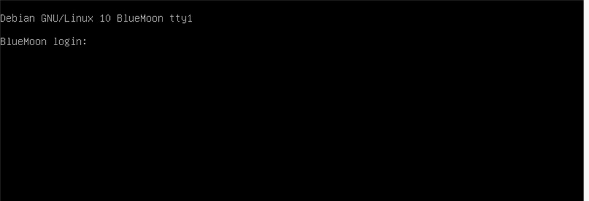

BlueMoon VM running and waiting for login

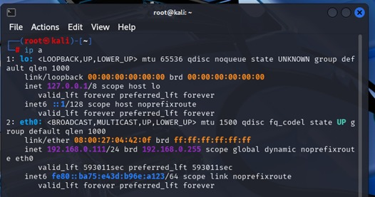

Kali Linux attacker machine ready

### 1.2 Kali IP Address

This screenshot shows the IP address of the attacker machine (Kali Linux) which is 192.168.0.111 on the eth0 interface. This confirms that Kali is on the same network as the target.

### 1.3 Network Discovery

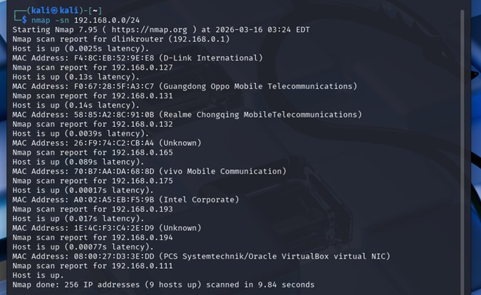

This screenshot shows the network discovery scan performed using the command: nmap -sn 192.168.0.0/24. The scan revealed 9 active hosts on the network. Among them, the target machine (BlueMoon) was identified as 192.168.0.194 with MAC address 08:00:27:D3:3E:DD, which belongs to PCS Systemtechnik/Oracle VirtualBox. This confirms that the BlueMoon VM is running and reachable on the network. The attacker machine (Kali Linux) is also shown as 192.168.0.111, confirming that both machines are on the same subnet and can communicate with each other.

### 1.4 Port Scanning

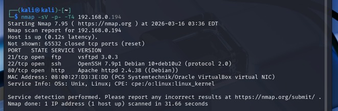

The Nmap scan against the target IP 192.168.0.194 revealed three open ports:
- Port 21 (FTP) running vsftpd 3.0.3
- Port 22 (SSH) running OpenSSH 7.9p1
- Port 80 (HTTP) running Apache 2.4.38
The MAC address 08:00:27:D3:3E:DD confirms this is a VirtualBox machine. These open ports will be the focus of further enumeration and exploitation.

### 1.5 Web Server Discovery

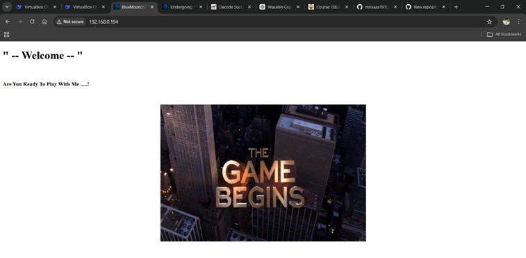

This screenshot shows the main web page accessed via browser at http://192.168.0.194. The page displays a simple message:

"-- Welcome --"
"Are You Ready To Play With Me ....!"
"THE GAME BEGINS"

This confirms that the web server (port 80) is functioning properly and serving content. The message suggests that this VM is intentionally vulnerable and hints that further exploration is needed to find hidden directories or files.

### 1.6 Directory Bruteforcing

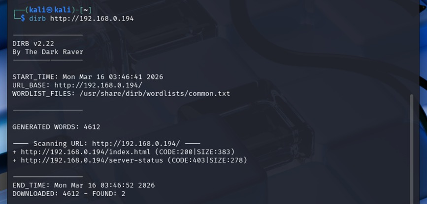

A directory bruteforce scan was conducted using Dirb against http://192.168.0.194. The scan completed quickly but only discovered basic pages (/index.html and /server-status), indicating that a larger wordlist would be required to find hidden directories like /hidden_text.

## PHASE 2: GAINING ACCESS

### 2.1 Hidden Text Discovery

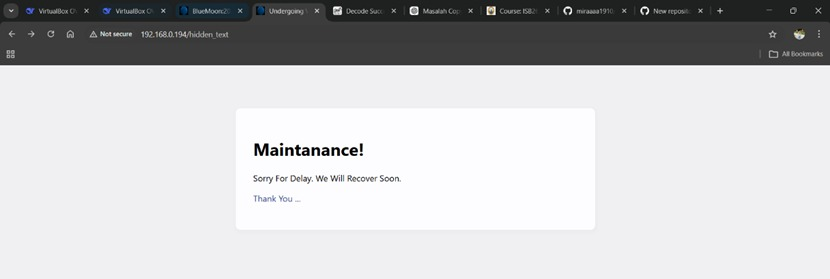

Accessing the /hidden_text directory revealed a maintenance page with a "Thank You ..." message. This page contains a hidden link that leads to a QR code image containing FTP credentials.

### 2.2 QR Code Image

Clicking the "Thank You" link on the maintenance page displayed this QR code image. The QR code contains embedded credentials for FTP access.

### 2.3 QR Code Decoding

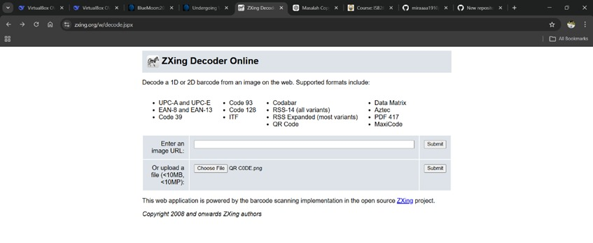

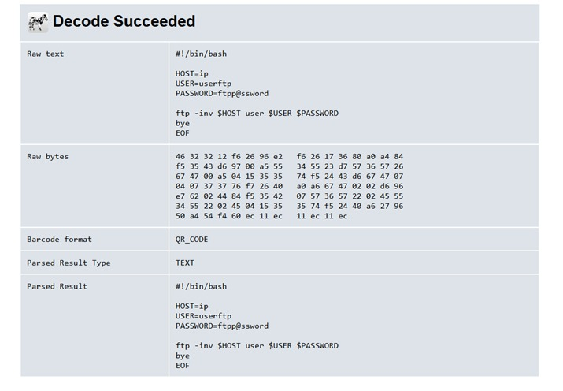

The QR code image was uploaded to the online decoder at https://zxing.org. This web application supports various barcode formats including QR Code, Data Matrix, and others. After uploading the image, the decoder extracted the hidden information embedded in the QR code.
The QR code was successfully decoded and revealed FTP credentials:
- Username: userftp
- Password: ftpp@ssword
These credentials will be used to access the FTP service on port 21 to retrieve further files for the penetration test.

## PHASE 3: FTP ACCESS

### 3.1 FTP Login

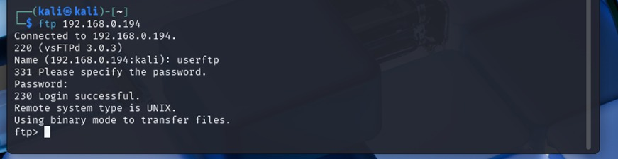

FTP login was performed using the credentials obtained from the QR code:
- Username: userftp
- Password: ftpp@ssword
The server responded with "230 Login successful", confirming access to the FTP service.

### 3.2 FTP File Listing

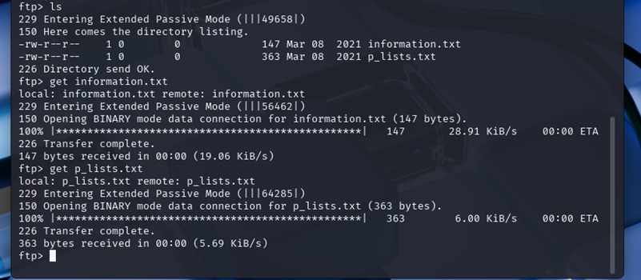

After successfully logging into the FTP server, the 'ls -la' command was used to list all files in the current directory. The output revealed two files of interest:
information.txt
p_lists.txt
These files were downloaded for further analysis as they likely contain valuable information for the next phase of the penetration test.

### 3.3 Downloading Files

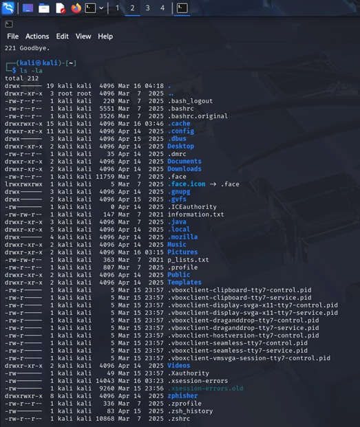

Both files were successfully downloaded using the 'get' command. The files are now saved on the local Kali machine for examination.

### 3.4 Information.txt Content

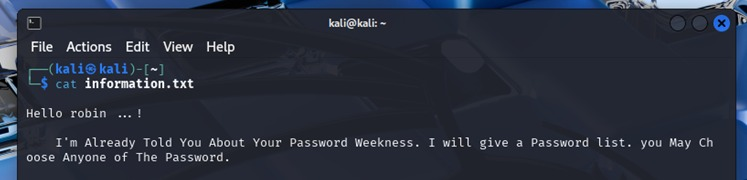

The information.txt file contains a message indicating that user "robin" exists on the system. This provides a valid username for further attacks.

### 3.5 Password List

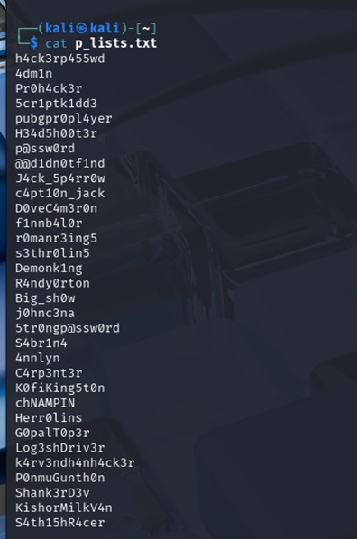

The p_lists.txt file contains a list of possible passwords. This will be used for brute forcing the SSH service to gain access as user robin.

## PHASE 4: SSH BRUTE FORCE & ACCESSPHASE 4: SSH BRUTE FORCE & ACCESS

### 4.1 Hydra SSH Brute Force

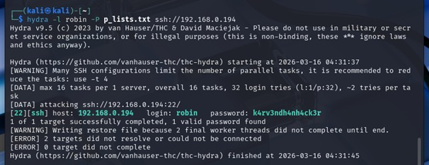

Using Hydra, a brute force attack was performed against the SSH service with username "robin" and the password list from p_lists.txt. The attack was successful and revealed robin's password: k4rv3ndh4nh4ck3r.

### 4.2 SSH Login as robin

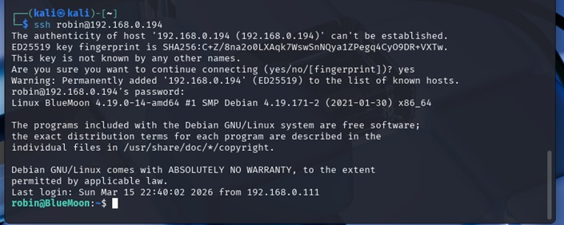

Using the cracked password, SSH login as user robin was successful. The shell prompt changed to robin@BlueMoon:~$, confirming access to the target system.

### 4.3 First Flag (User 1)

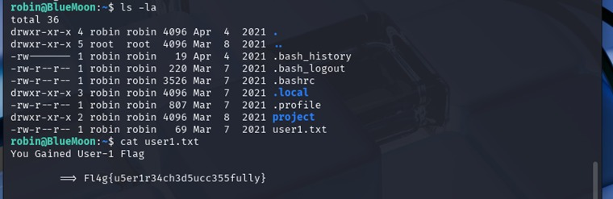

The first flag was found in robin's home directory:
*Fl4g{u5er1r34ch3d5ucc355fully}*

## PHASE 5: PRIVILEGE ESCALATION (robin → jerry)

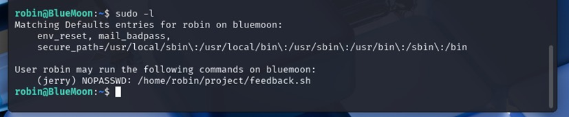

The 'sudo -l' command shows what commands robin can run with elevated privileges. The output reveals that robin can execute /home/robin/project/feedback.sh as user jerry without providing a password:
(jerry) NOPASSWD: /home/robin/project/feedback.sh
This is a privilege escalation opportunity.

### 5.2 Project Directory Listing

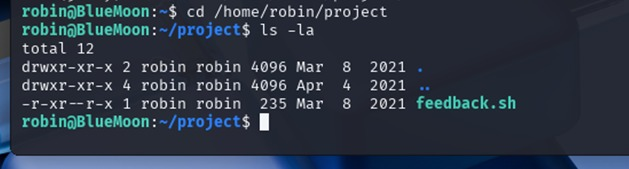

Navigating to /home/robin/project reveals the feedback.sh script mentioned in the sudo privileges. This script is owned by robin and can be executed as user jerry.

### 5.3 Feedback.sh Script Content

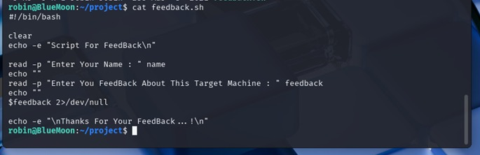

The feedback.sh script is a simple bash script that takes user input for a name and feedback, then displays a thank you message. This script can be exploited by injecting a command into the feedback field.

### 5.4 Executing Script as jerry

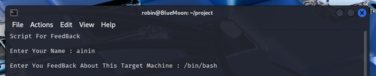

The feedback.sh script was executed as user jerry using sudo. When prompted for feedback, the input "/bin/bash" was provided, which spawned a shell as user jerry.

### 5.5 Confirming User jerry

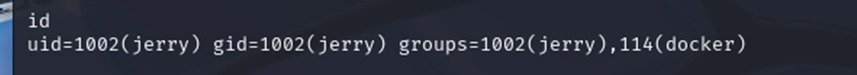

The 'id' command confirms that we are now user jerry with UID 1002. Importantly, jerry is a member of the docker group (GID 114), which will be used for root privilege escalation later.

### 5.6 Second Flag (User 2)

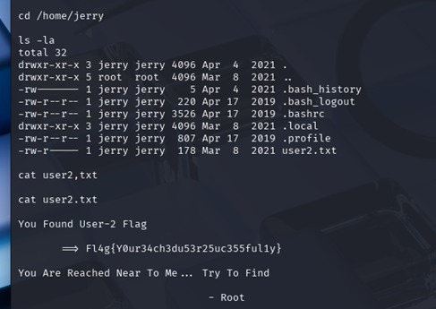

The second flag was found in jerry's home directory:
*Fl4g{Y0ur34ch3du53r25uc355ful1y}*

## PHASE 6: ROOT PRIVILEGE ESCALATION (jerry → root)

### 6.1 Docker Images

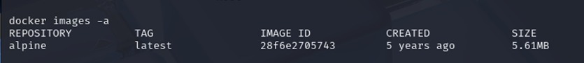

Since user jerry is a member of the docker group, we can use Docker to escalate privileges. The 'docker images -a' command shows that the Alpine Linux image is available on the system, which can be used for container escape.

### 6.2 Root via Docker & Confirmation

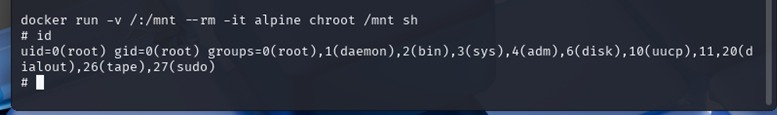

The following Docker command was used to gain root access:
- -v /:/mnt : Mounts the host's root directory to /mnt inside container
- --rm : Removes container after exit
- -it : Interactive mode
- alpine : Uses Alpine Linux image
- chroot /mnt sh : Changes root to /mnt and spawns shell
This command mounts the entire host filesystem and provides a shell with root privileges.
The 'id' command confirms we are now root with UID 0 and GID 0. The prompt has changed to '#' indicating root shell.

### 6.3 Final Flag (Root Flag)

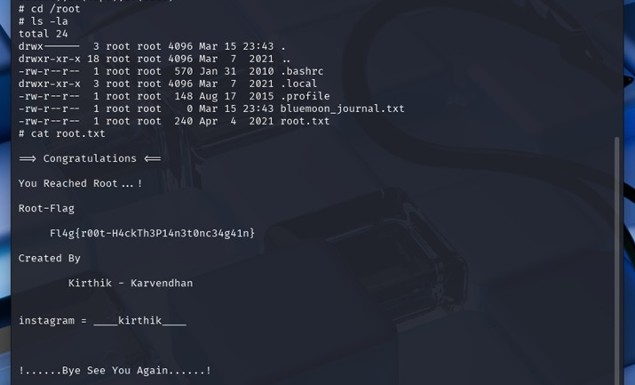

The final flag was found in /root/root.txt:
*Fl4g{r00t-H4ckTh3P14n3t0nc34g41n}*
This confirms that root access has been successfully achieved. The root flag file also contains a congratulatory message from the VM creator: "Congratulations You Reached Root ... !"

## PHASE 7: MAINTAIN ACCESS

### 7.1 Creating Backdoor User

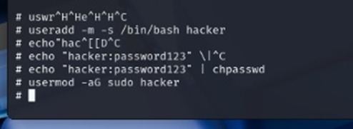

To maintain persistent access to the system, a new user "hacker" was created with password "password123" and granted passwordless sudo privileges by adding to /etc/sudoers. This allows future logins without repeating the exploitation process.

### 7.2 Verifying Backdoor User

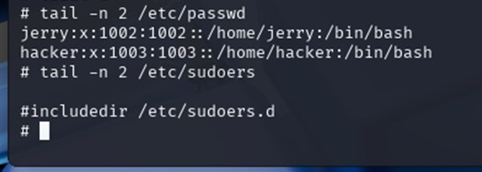

The /etc/passwd file confirms the hacker user has been created successfully, and the /etc/sudoers file shows the passwordless sudo privilege has been granted. This ensures persistent access even after system reboot.

## PHASE 8: CLEAR TRACKS

### 8.1 Clearing Bash History

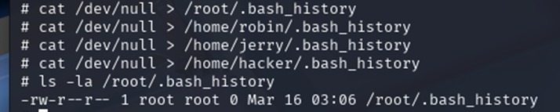

All bash history files were successfully cleared using the command: cat /dev/null > [path]/.bash_history. The 'ls -la' command confirms that /root/.bash_history now has a file size of 0 bytes, indicating that all command history has been removed. The same method was applied to other users (robin, jerry, hacker) to ensure complete removal of tracks.

 ## PHASE 9: FINAL RESULTS

 ### 9.1 All Flags Obtained

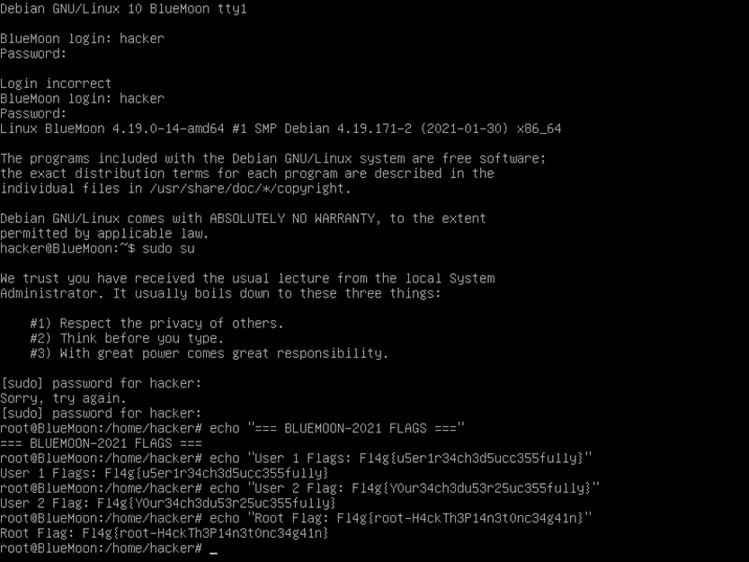
 
After successfully maintaining access through the backdoor user "hacker", root privileges were obtained via sudo. All three flags were then displayed to confirm the completion of the penetration test:
- **User 1 Flag:** `Fl4g{u5er1r34ch3d5ucc355fully}`
- **User 2 Flag:** `Fl4g{Y0ur34ch3du53r25uc355ful1y}`
- **Root Flag:** `Fl4g{r00t-H4ckTh3P14n3t0nc34g41n}`
The system hacking methodology from reconnaissance to privilege escalation, maintaining access, and clearing tracks was successfully executed.*
